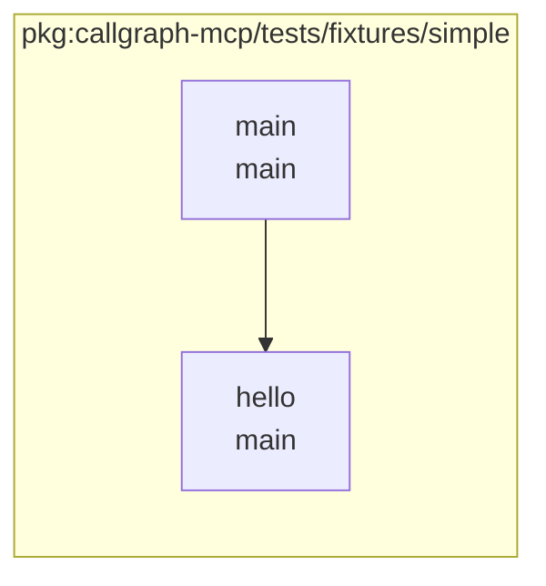

# callgraph-mcp

**callgraph-mcp** 是一个基于 [Model Context Protocol (MCP)](https://modelcontextprotocol.io/) 的 Go 调用图分析工具。

## 功能特性

- 🔍 **静态分析**：支持 `static`、`cha`、`rta` 三种调用图算法
- 🎯 **精确过滤**：支持包路径过滤、标准库过滤、未导出函数过滤等
- 📊 **Mermaid 输出**：返回 Mermaid flowchart 格式的调用图，支持包分组和文件位置注释
- 🔌 **MCP 协议**：完全兼容 Model Context Protocol，可与支持 MCP 的客户端集成
- ⚡ **高性能**：基于 Go 的 SSA 中间表示进行分析

## 安装

```bash
go build -o callgraph-mcp
```

## 使用方法

### 作为 MCP 服务器

callgraph-mcp 主要设计为 MCP 服务器使用。启动服务器：

```bash
./callgraph-mcp
```

### MCP 工具调用

服务器提供一个统一的工具：

#### callHierarchy - 调用层级生成

- 不指定 `symbol`：生成指定包的完整调用图（Mermaid 格式）
- 指定 `symbol`：从符号出发按方向遍历（upstream/downstream/both），生成调用图

**必需参数**：
- `moduleArgs` ([]string): 要分析的包路径，例如 `["./..."]` 或 `["./cmd/myapp"]`

**可选参数**：
- `algo` (string): 分析算法，可选值：`static`（默认）、`cha`、`rta`
- `dir` (string): 工作目录，用于解析相对路径，默认当前目录
- `focus` (string): 聚焦特定包（按名称或导入路径）
- `group` (string): 分组方式，可选值：`pkg`（默认）、`type`，用逗号分隔
- `limit_keyword` (string): 包路径关键词过滤（逗号分隔关键词，caller 和 callee 必须同时匹配）
- `ignore` (string): 包路径过滤（逗号分隔关键词）
- `limit_prefix` (string): 包路径前缀过滤（逗号分隔前缀，caller 和 callee 必须同时匹配）

- `nostd` (boolean): 忽略标准库调用（默认 `true`）
- `nointer` (boolean): 忽略未导出函数调用（默认 `true`）
- `tests` (boolean): 包含测试代码（默认 `false`）
- `tags` ([]string): 构建标签（默认空）
- `debug` (boolean): 启用详细日志（默认 `false`）
- `symbol` (string): 起始函数符号，例如 `main.main`、`hello` 或完整路径 `callgraph-mcp/tests/fixtures/simple.main`
- `direction` (string): 遍历方向，可选值：`downstream`（默认）、`upstream`、`both`

**示例请求（包级调用图）**：
```json
{
  "jsonrpc": "2.0",
  "id": 1,
  "method": "tools/call",
  "params": {
    "name": "callHierarchy",
    "arguments": {
      "moduleArgs": ["./examples/main"],
      "algo": "static",
      "nostd": true,
      "focus": "main"
    }
  }
}
```

**示例请求（符号定向遍历）**：
```json
{
  "jsonrpc": "2.0",
  "id": 1,
  "method": "tools/call",
  "params": {
    "name": "callHierarchy",
    "arguments": {
      "moduleArgs": ["./tests/fixtures/simple"],
      "algo": "static",
      "nostd": true,
      "group": "pkg",
      "symbol": "main.main",
      "direction": "downstream"
    }
  }
}
```

### 响应格式

工具返回 Mermaid flowchart 格式的调用图：



#### Mermaid 格式特性

- **包分组**: 使用 `subgraph` 按包路径分组函数
- **节点标签**: 显示函数名和包名，格式为 `"函数名<br/>包名"`
- **文件位置**: 每个节点后有注释行，显示文件名和行号，使用 `%% 文件名:行号`
- **调用关系**: 使用箭头 `-->` 表示函数调用
- **ID 安全化**: 节点 ID 经过处理，兼容 Mermaid 语法

## 算法说明

### Static Analysis (`static`)
- 最快的分析方法
- 基于静态调用关系
- 不考虑动态调用和接口调用

### Class Hierarchy Analysis (`cha`)
- 考虑类型层次结构
- 处理接口调用
- 比 static 更精确，但速度较慢

### Rapid Type Analysis (`rta`)
- 最精确的分析方法
- 考虑实际可达的类型
- 分析速度最慢，但结果最准确

## 过滤选项

### 包路径过滤
- `limit_keyword`: 只包含包含指定关键词的包（caller 和 callee 必须同时匹配）
- `ignore`: 排除包含指定关键词的包
- `limit_prefix`: 强制包含指定前缀的包（caller 和 callee 必须同时匹配）

### 函数过滤
- `nostd`: 排除标准库函数调用
- `nointer`: 排除未导出函数调用

### 聚焦分析
- `focus`: 只分析与指定包相关的调用关系

## 开发

### 测试

项目包含完整的测试套件，分为单元测试和集成测试：

```
tests/
├── unit/                    # 单元测试
├── integration/             # 集成测试
└── fixtures/                # 测试数据
```

#### 运行测试

```bash
# 运行所有测试
go test ./tests/...

# 只运行单元测试
go test ./tests/unit/...

# 只运行集成测试
go test ./tests/integration/...

# 使用测试工具
cd tests && make test-all
```

#### 快速演示

项目提供了一个演示程序，可以快速测试 callgraph 工具的功能：

```bash
# 运行演示程序
go run ./cmd/demo

# 演示程序会分析 tests/fixtures/simple 包
# 使用 nostd=true 和 group=pkg 参数
# 输出简洁的 Mermaid flowchart 格式
```

演示程序的输出示例：
```
=== Mermaid Output (improved nostd=true, group=pkg) ===
flowchart LR
subgraph "pkg:callgraph-mcp/tests/fixtures/simple"
callgraph_mcp_tests_fixtures_simple_main["main<br/>main"]
%% main.go:9
callgraph_mcp_tests_fixtures_simple_hello["hello<br/>main"]
%% main.go:5
end
callgraph_mcp_tests_fixtures_simple_main --> callgraph_mcp_tests_fixtures_simple_hello

=== End (Length: 293 characters) ===
```

这个演示展示了：
- 包分组功能（subgraph）
- 函数调用关系（main -> hello）
- 文件位置注释（%% main.go:5）
- 标准库过滤效果（不显示 fmt.Println 调用）

更多测试相关信息请参考 [tests/README.md](tests/README.md)。

### 构建

```bash
go build -o callgraph-mcp
```

## 参考项目
- [go-callvis](https://github.com/ofabry/go-callvis)

---

**版本**: v0.1.0
